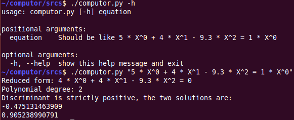

# Equation Solver 

This project allow to solve polynomial equation in the following degrees :

* 0
* 1
* 2

## Language

Used Python 2.7 for this project

## How to use

    ./computor.py "5 * X^0 + 4 * X^1 - 9.3 * X^2 = 1 * X^0"
    ./computor.py "5 * X^0 + 4 * X^1 - 9.3 * X^2 = 0"
    ...

**See the illustrated example below :**

    
**In python projects :**

    from computor import computor

## Contributors

* Julie Rossi
* Umi Lefebvre
* Julien Balestra
