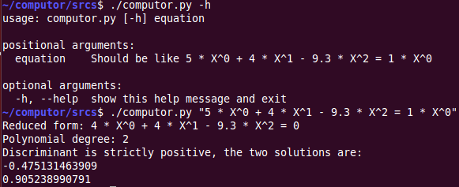

# Equation Solver

**Online demo:**
[demo.julienbalestra.com/computor](demo.julienbalestra.com/computor "demo.julienbalestra.com/computor")

This project allow to solve polynomial equation in the following degrees :

* 0
* 1
* 2

## Language

Used Python 2.7 for this project with flask / jinja

## How to use

The symlink run-me allow you to run srcs/computor.py

    ./run-me "5 * X^0 + 4 * X^1 - 9.3 * X^2 = 1 * X^0"
    ./run-me "5 * X^0 + 4 * X^1 - 9.3 * X^2 = 0"
    ...
    ./run-me "5 * X^0 + 4 * X^1 - 9.3 * X^2 = 0" -g True

**See the illustrated example below :**

    
**In python projects :**

    from computor import Equation
    
**With the Web platform :**

    python web_engine.py
    
    
## Amazon Web Services EB

This project is ready to be pushed on AWS Elastic Beanstalk.

* Create an application 
* Choose a web server environment
* Select a python platform and downgrade it to 2.7
* Just upload a git archive on the EB platform :

    git archive --format=zip HEAD > computor.zip
    

or use the eb command line tool : [online doc](http://docs.aws.amazon.com/elasticbeanstalk/latest/dg/eb-cli3.html "online doc")

## Contributors

*Note the srcs/sample.py (and associate srcs/tests/test_sample.py) is a community draft used to get the coding guidelines*

* Julie Rossi
* Umi Lefebvre
* Julien Balestra
